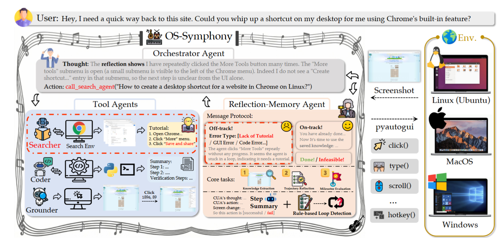

<div align="center">
  
   <h1 style="font-family: 'Times New Roman', serif; font-weight: bold; font-size: 2.5em; margin-top: 10px;">
    OS-Symphony
  </h1>
  <h3 style="font-style: italic; color: #555;">
    A Holistic Paradigm for Generalist Computer-Using Agents
  </h3>
</div>

**Official repository for the paper: [OS-SYMPHONY: A Holistic Framework for Robust and Generalist Computer-Using Agents]()**.

[]() []()

## 📑 Table of Contents
- [🗞️ Updates](#-updates)
- [💡 Overview](#-overview)
- [📊 Results](#-results)
  - [🐧 OSWorld-Verified (Ubuntu)](#-osworld-verified-ubuntu)
  - [🪟 WindowsAgentArena（Windows）](#-windowsagentarenawindows)
  - [🍎 MacOSArena（MacOS）](#-macosarenamacos)
- [🛠️ Environment & Setup](#️-environment--setup)
  - [1. Installation](#1-installation)
  - [2. VM Configuration](#2-vm-configuration)
  - [3. Running Evaluation](#3-running-evaluation)
  - [4. Visualization](#4-visualization)
- [✨ Features](#-features)
- [😊 Acknowledgement](#-acknowledgement)
- [📃 Citation](#-citation)

## 🗞️ Updates

- **[2026-01-06]** 🎉 We have released the initial version of our [paper](), [code](https://github.com/OS-Copilot/OS-Symphony), and [project page]().

- **[2026-01-04]** 🎉 **Congratulations:** OS-Symphony has achieved a score of **65.8** on the [OSWorld Official Evaluation](https://os-world.github.io/) (using GPT-5 + UI-TARS-1.5-7B with 50 steps). As of now, this ranks **5th** overall, **3rd** among methods without multiple rollout, and **1st** under the 50-steps constraint！

  > **Note:** The evaluation results reported in our paper are lower due to limitations within the virtual machine environment.  You are allowed to compare against the metrics in our paper, we highly encourage comparing against the official evaluation results.

## 💡 Overview

**OS-Symphony** is a holistic framework designed to address the robustness and generalization challenges faced by current Computer-Using Agents (CUAs). It introduces an **Orchestrator** that coordinates two key innovations:

1.  **Reflection-Memory Agent (RMA):** Utilizes milestone-driven long-term memory and a structured message protocol to enable trajectory-level self-correction, effectively mitigating visual context loss in long-horizon tasks.
2.  **Versatile Tool Agents:** Features a **Multimodal Searcher** that adopts a "See-and-Act" paradigm to navigate the web and synthesize live, visually aligned tutorials, resolving fidelity issues in out-of-distribution scenarios.

By synergizing these components, OS-Symphony achieves robust automation across diverse operating systems and complex workflows.



## 📊 Results

OS-Symphony establishes new SOTA performance across three major benchmarks.

### 🐧 OSWorld-Verified (Ubuntu)

| Backbone | Steps | Success Rate |
| :--- | :---: | :---: |
| **GPT-5** | **100** | **65.8%** |
| GPT-5 | 50 | 63.6% |
| GPT-5-Mini | 50 | 58.1% |
| Qwen3-VL-32B-Thinking | 50 | 50.2% |
| Qwen3-VL-32B-Instruct | 50 | 46.9% |

### 🪟 WindowsAgentArena（Windows）

| Backbone | Steps | Success Rate |
| :--- | :---: | :---: |
| **GPT-5** | **50** | **63.5%** |
| GPT-5-Mini | 50 | 62.2% |
| Qwen3-VL-32B-Thinking | 50 | 46.0% |
| Qwen3-VL-32B-Instruct | 50 | 45.3% |

### 🍎 MacOSArena（MacOS）

| Backbone | Steps | Success Rate |
| :--- | :---: | :---: |
| GPT-5 | 50 | 41.3% |
| **GPT-5-Mini** | **50** | **46.0%** |
| Qwen3-VL-32B-Instruct | 50 | 19.1% |

> **Note:** Our framework empowers open-source models (e.g., Qwen3-VL series) to achieve competitive performance, significantly narrowing the gap with proprietary SOTA models.

## 🛠️ Environment & Setup

### 1. Installation

Set up the runtime virtual environment and install the necessary browser engines：

```bash
# Install Python dependencies
pip install -r requirements.txt

# Install Playwright browser binaries
playwright install
```

### 2. VM Configuration

Configuring the Virtual Machine environments is a critical step. Please strictly follow the instructions in **[SETUP.md](SETUP.md)/[SETUP_zh.md](SETUP_zh.md)** to download resources and configure the Golden Images for Linux, Windows, and MacOS.

### 3. Running Evaluation

Launch the evaluation using the provided shell script. You will need to modify the parameters in `crucial_scripts/run_os_symphony.sh` to match your experiments：

```bash
bash crucial_scripts/run_os_symphony_docker.sh
```

We now also support OSWorld Evaluation via AWS Cloud. You can **skip Step 2**. Instead, please configure your cloud services by referring to the [official AWS documentation](https://github.com/xlang-ai/OSWorld/blob/main/desktop_env/providers/aws/AWS_GUIDELINE.md), and then run：

```bash
bash crucial_scripts/run_os_symphony_aws_official.sh
```

**Key Configuration Parameters:**

#### 🖥️ Environment Settings

| Parameter             | Description                                                  |
| :-------------------- | :----------------------------------------------------------- |
| `path_to_vm`          | Path to the VM Golden Image.<br>⚠️ **For MacOSArena:** Must be two paths separated by a space: `"/path/to/mac_hdd_ng.img /path/to/BaseSystem.img"` |
| `searcher_path_to_vm` | Path to the Linux Search Environment image (`/path/to/Ubuntu.qcow2`). |
| `num_envs`            | Number of concurrent processes for parallel evaluation.      |
| `proxy`               | Network proxy URL (Format: `http://<ip>:<port>`). Required for OSWorld and WindowsAgentArena. |
| `client_password`     | VM login password. Use `"password"` for OSWorld and `"1234"` for MacOSArena. |

#### 🤖 Agent Settings

| Parameter                                                   | Description                                                  |
| :---------------------------------------------------------- | :----------------------------------------------------------- |
| `xx_provider，xx_model，xx_url，xx_api_key，xx_temperature` | Configuration for VLM inference (OpenAI-compatible API). We recommend using **vLLM** for open-source models. |
| `coder_budget`, `searcher_budget`                           | Maximum inner-loop iterations for the Coder and Searcher Agents, default is 20. |
| `searcher_engine`                                           | Search engine provider. We recommend `duckduckgo` over Google to avoid CAPTCHA blocks. |
| `memoryer_max_images`                                       | Maximum number of images retained in the Reflection-Memory Agent. |
| `grounding_smart_resize`                                    | Enable for models requiring smart resizing (e.g., GTA1-32B, ScaleCUA series, UI-TARS-1.5). |
| `orchestrator_keep_first_image`                             | Whether to keep the initial screenshot in the context, default is True. |
| `tool_config`                                               | Configuration for the action space, allowing dynamic assembly of tools. |

#### 🧪 Experiment Settings

| Parameter           | Description                                              |
| :------------------ | :------------------------------------------------------- |
| `exp_name`          | Name of the experiment (defines the results directory).  |
| `enable_reflection` | Whether enable the Reflection-Memory Agent (RMA) module. |
| `max_steps`         | Maximum number of steps allowed per task.                |
| `benchmark`         | Target benchmark: `osworld`, `waa`, or `macosarena`.     |

### 4. Visualization

Results are saved in `results/{exp_name}` and logs in `logs/{exp_name}.log`.

To visualize the execution process and generate statistical reports, run the Gradio interface:

```bash
python gradio/gradio_show_result.py --root_dir results/{exp_name} --port 10000
```

## ✨ Features

1. **Unified Cross-Platform Evaluation:** We decouple the  agent logic from the OS environment, providing a unified interface to  evaluate agents across Linux, Windows, and MacOS seamlessly.
2. **Enhanced Robustness:** We have addressed numerous environment instability issues and bugs found in the original codebases of the supported benchmarks.
3. **Extensibility:** Support for defining more custom tasks.
4. **Custom Workflows:** Flexible architecture allowing to customize Agent workflows and tool configurations.

We welcome the community to use our codebase for evaluating your own agents and tasks.

## 😊 Acknowledgement

We express our deepest gratitude to the following excellent projects for their contributions of GUI automation: [OSWorld](https://github.com/xlang-ai/OSWorld), [WindowsAgentArena](https://github.com/microsoft/WindowsAgentArena), [MacOSArena](https://github.com/open-compass/MMBench-GUI), [Agent S series](https://github.com/simular-ai/Agent-S), [UI-TARS series](https://github.com/bytedance/UI-TARS), [GTA1](https://github.com/Yan98/GTA1), [ScaleCUA](https://github.com/OpenGVLab/ScaleCUA) *etc.*

## 📃 Citation

If you find this project useful in your research, please cite our paper：

```tex
@article{ossymphony2026,
  title={OS-Symphony: A Holistic Framework for Robust and Generalist Computer-Using Agents},
  author={Shanghai AI Lab OS-Copilot Team},
  journal={https://github.com/OS-Copilot/OS-Symphony},
  year={2026}
}
```