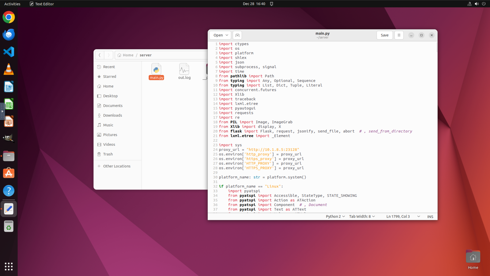
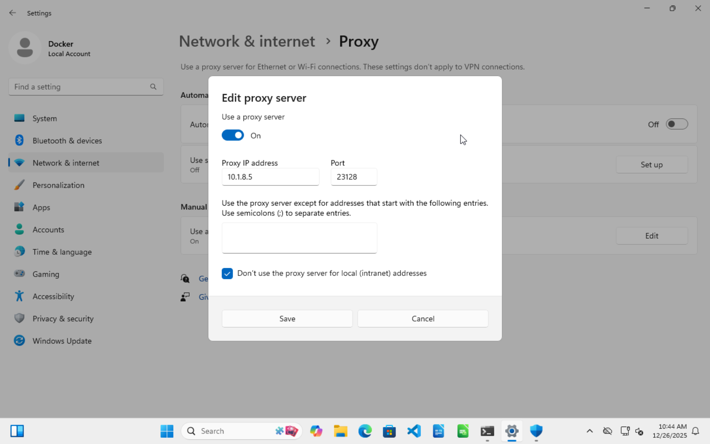
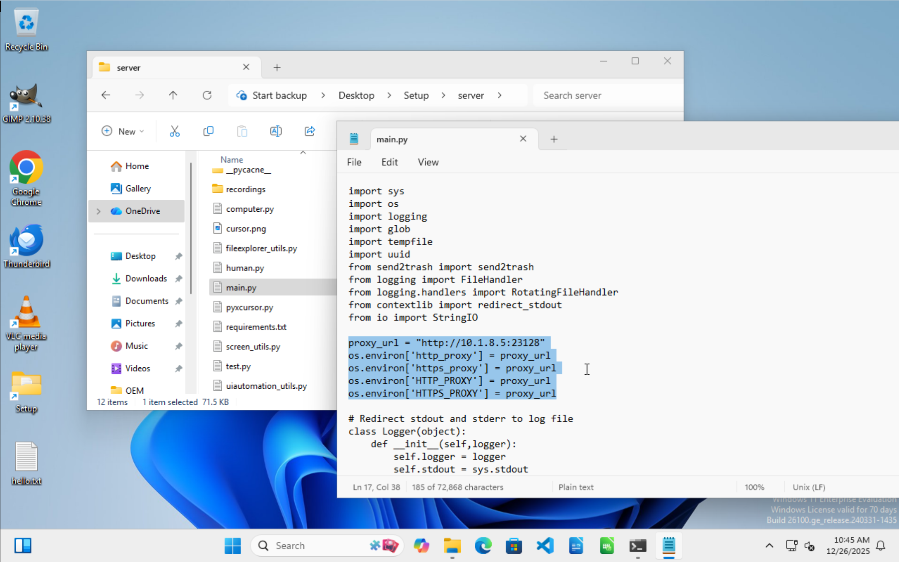
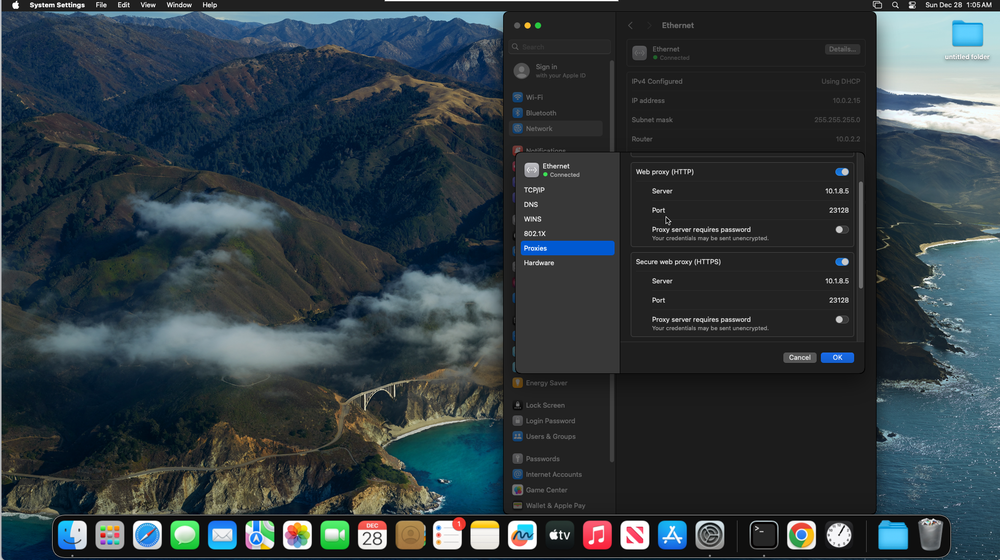

# 🛠️ Environment Setup & Configuration Guide

This document details the resource download, startup, and network proxy configuration processes for the three operating system environments required for evaluation (Linux, Windows, and MacOS).

## 1. Resource Download

Please download the required Docker images and Virtual Machine "Golden Image" files according to the table below.

| Component          | Linux (OSWorld / SearchEnv)                                  | Windows (WindowsAgentArena)                                  | MacOS (MacOSArena)                                           |
| :----------------- | :----------------------------------------------------------- | :----------------------------------------------------------- | :----------------------------------------------------------- |
| **Docker Image**   | `docker pull happysixd/osworld-docker`                       | `docker pull yang695/winarena:latest`                        | `docker pull numbmelon/docker-osx-evalkit-auto:latest`       |
| **Golden Image**   | **[Ubuntu.qcow2](https://huggingface.co/datasets/xlangai/ubuntu_osworld/resolve/main/Ubuntu.qcow2.zip)** | **[waa.tar.gz](https://huggingface.co/datasets/YYangzzzz/OSSymphony/blob/main/winarena/waa.tar.gz)**<br>*(After unzipping, please rename the folder to `golden_image`)* | **[BaseSystem.img](https://huggingface.co/OpenGVLab/ScaleCUA_Env/blob/main/resources/macos/BaseSystem.img)** + **[mac_hdd_ng.img](https://huggingface.co/OpenGVLab/ScaleCUA_Env/blob/main/resources/macos/mac_hdd_ng.img)** |
| **Start Script**   | `crucial_scripts/start_osworld_container.sh`                 | `crucial_scripts/start_waa_container.sh`                     | `crucial_scripts/start_macosarena_container.sh`              |
| **Cleanup Script** | `crucial_scripts/remove_all_osworld_container.sh`            | `crucial_scripts/remove_all_waa_conntainer.sh`               | `crucial_scripts/remove_all_macosarena_container.sh`         |

### Notes:

1.  **Necessary Environment:** The Linux environment also serves as the running environment for Searcher Agent, so it is **mandatory**.
2.  **Start Script:** The "Start Script" provided in the table above is used to start a single virtual machine for debugging and configuration (such as configuring proxies).
    *   **Operation:** Please edit the script before use to fill in the path to your locally downloaded Golden Image.
    *   **VNC:** It is recommended to use **RealVNC** to connect to the GUI interface of the virtual machine.
3.  **Persistence Mechanism:**
    *   **Linux/MacOS:** Modifications made on the GUI interface will **not** be automatically reflected in the original Golden Image file.
    *   **Windows:** Operations will **directly modify** the original image file. **Please be sure to back up the original `golden_image` folder before starting any operations.**
4.  **Cleanup Script:** The "Cleanup Script" provides a one-click function to clear residual containers from the evaluation.

---

## 2. Global Proxy Configuration

In an intranet environment, network configuration is the most critical part of the evaluation environment. We need to implement **Global Proxy Configuration** by modifying internal virtual machine settings (System-level + Flask Server-level) before starting the evaluation + using the `proxy` parameter when starting the evaluation.

**Note:**

1.  The Flask Server runs as a startup script, so system-level proxies are invalid for it; therefore, it must be configured manually and separately.
2.  The proxies for Windows and Mac are already written inside the Golden Image. If the host environment does not require a proxy, please also note that you need to follow the process below to delete the proxy!

### 🐧 Linux (OSWorld)

Docker usually mounts images as read-only layers. To modify the `main.py` of the internal Flask Server, we need to use `libguestfs-tools` to inject modifications directly into the `.qcow2` file.

**Steps:**

1.  **Locate File:** Open `desktop_env/osworld/server/main.py` in the local codebase.

2.  **Edit Proxy:** Modify the `proxy_url` variable at the top of the file to your proxy address (Format: `http://<ip>:<port>`).

3.  **Install Tools (taking CentOS as an example):**

    ```bash
    sudo yum install libguestfs-tools
    sudo systemctl start libvirtd
    ```

4.  **Start Guestfish:** Start guestfish in writable mode:

    ```bash
    sudo guestfish -a /path/to/your_vm.qcow2 -i
    ```

5.  **Inject File:** Execute the following command in the interactive shell (`><fs>`) to permanently modify the image:

    ```bash
    upload desktop_env/osworld/server/main.py /home/user/server/main.py
    ```

6.  **Verify Modification:** Open `main.py` inside the virtual machine; it is expected to be successfully modified.
    

> *Note: Linux system-level proxies will be configured via parameters during evaluation startup and do not require image modification.*

### 🪟 Windows (WindowsAgentArena)

The Windows image is mounted directly. Changes made inside the virtual machine will be saved directly to the source file. **Please be sure to backup first.**

**Steps:**

1.  **System Proxy:** Go to **Settings** > **Network & Internet** > **Use a proxy server**, configure the IP and Port, and check ✔ **Don’t use the proxy server for local addresses**.

    

2.  **Server Proxy:** Open `C:\OEM\server\main.py` inside the virtual machine, find the `proxy_url` variable, and set the proxy address.

    

#### ⚠️ Important: Image Expiration & Rebuilding

The Windows Enterprise Evaluation image has a 90-day validity period (expiring approx. **2026.03.10**). After expiration, the system will automatically shut down after 1 hour of uptime. If you need to evaluate long-horizon tasks (>1h), you need to rebuild the Golden Image (unless using cheat methods).

**Rebuild Tips:**

1.  No need to rebuild the Docker image, only regenerate the Virtual Machine Golden Image.

2.  **Setup Script Proxy:** When rebuilding, please add the following code to the top of the `setup.ps1` file to ensure dependencies can be downloaded normally:

    ```powershell
    # 1. Set your proxy address (Please modify IP and Port according to actual situation)
    $ProxyHost = "10.1.8.5"  # Replace with your Host IP or LAN Proxy IP
    $ProxyPort = "23128"     # Replace with your Proxy Port (e.g., Clash is usually 7890)
    $ProxyUri = "http://$($ProxyHost):$($ProxyPort)"
    
    Write-Host "Configuring System Proxy to: $ProxyUri ..." -ForegroundColor Cyan
    
    # 2. Configure PowerShell / .NET default Web Proxy
    #    This solves connection issues for Invoke-WebRequest, System.Net.WebClient, and most PowerShell download functions
    $WebProxy = New-Object System.Net.WebProxy($ProxyUri)
    [System.Net.WebRequest]::DefaultWebProxy = $WebProxy
    
    # 3. Configure Environment Variable Proxies
    #    This solves connection issues for Python (pip), Git, Curl, and other third-party tools
    $env:HTTP_PROXY = $ProxyUri
    $env:HTTPS_PROXY = $ProxyUri
    $env:http_proxy = $ProxyUri
    $env:https_proxy = $ProxyUri
    $env:PIP_TRUSTED_HOST = "pypi.org pypi.python.org files.pythonhosted.org"
    
    # 4. Configure WinHTTP Proxy (System-level)
    #    Some underlying services or installers may not use user environment variables and need to be configured via netsh
    Start-Process -FilePath "netsh" -ArgumentList "winhttp set proxy $ProxyHost`:$ProxyPort" -NoNewWindow -Wait
    
    Write-Host "Proxy configuration completed." -ForegroundColor Green
    ```

3.  **LibreOffice:** Currently, LibreOffice download fails even with a proxy configured. Please download and install it manually after the automated installation completes.

### 🍎 MacOS (MacOSArena)

Docker creates an overlay layer. Changes made in the GUI will **not** be automatically saved to the source `mac_hdd_ng.img` file. You must manually extract the modified file.

**Steps:**

1.  **System Proxy:** Go to **System Settings** > **Network** > **Ethernet** > **Details** > **Proxies**. Configure proxies for both **HTTP** and **HTTPS**.

    

2.  **Save Changes:** Copy the modified virtual machine image out of the container to serve as the Golden Image for the upcoming evaluation:

    ```bash
    docker cp <your_container_id>:/home/arch/OSX-KVM/mac_hdd_ng.img <target_path>/mac_hdd_ng_proxy.img
    ```

> *Note: The MacOS environment transmits commands via SSH and does not use a Flask Server, so there is no need to configure server-side code proxies.*